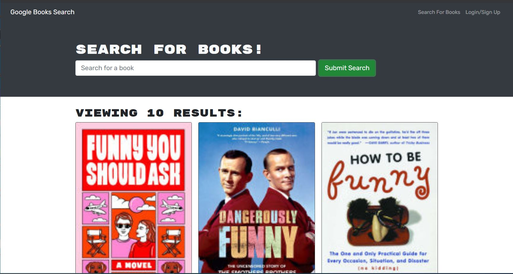

# Book Search Engine

<!-- TABLE OF CONTENTS -->

  
Table of Contents

  <ol>
    <li><a href="#description">Description</a></li>
    <li><a href="#user-story">User Story</a></li>
    <li><a href="#built-with">Built With</a></li>
    <li><a href="#maintainer">Contributing</a></li>
    <li><a href="#license">License</a></li>
    <li><a href="#site-link">Site Link</a></li>
    <li><a href="#screenshot">Screenshot</a></li>
  </ol>

## Description

This week, you’ll take a fully functioning Google Books API search engine built with a RESTful API, and refactor it to be a GraphQL API built with Apollo Server. The app was built using the MERN stack, with a React front end, MongoDB database, and Node.js/Express.js server and API. It's already set up to allow users to save book searches to the back end.

## User Story

AS AN avid reader
I WANT to search for new books to read
SO THAT I can keep a list of books to purchase

## Built-with

JavaScript, Node, NPM, MongoDB, Apollo, GraphQL

## Maintainer

<a href="mailto:bobpruz@gmail.com">Email: Robert Prusinowski</a>

## License

## Site Link

https://bobpruz-booksearch.herokuapp.com/

## Screenshot

